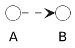

# plantuml-black-and-white-style

Usage:

```plantuml
!include https://raw.githubusercontent.com/dmitrvk/plantuml-black-and-white-style/main/base.puml
```

Full example:

```plantuml
'PlantUML Online Editor: https://www.planttext.com/

@startuml

!include https://raw.githubusercontent.com/dmitrvk/plantuml/main/base.puml

() A
() B

A .> B

@enduml
```


