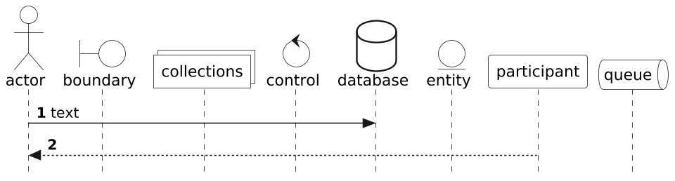

# PlantUML Black & White Theme

This is a theme file for PlantUML diagramming tool.

## Usage

Paste the following line right after the `@startuml` directive:

```plantuml
!theme bw from https://raw.githubusercontent.com/dmitrvk/plantuml-black-and-white/main
```

or download theme file:

```
wget https://raw.githubusercontent.com/dmitrvk/plantuml-black-and-white/main/puml-theme-bw.puml
```

and include it in your diagram:

```plantuml
!theme bw from .
```

## Examples


<details>
<summary>Source code</summary>

```plantuml
@startuml

!theme bw from https://raw.githubusercontent.com/dmitrvk/plantuml-black-and-white/main

package package {
  interface Interface {
    +methodA()
    +methodB()
  }

  class ClassA {
    +fieldA()
    -fieldB()
    --
    +methodA()
    -methodB()
    #methodC()
  }

  class ClassB {
  }
}

A <-- I
B <.. J
C <|-- K
D <|.. L
E *-- M
F o-- N
G -- O
H .. P

@enduml
```

</details>



<details>
<summary>Source code</summary>

```plantuml
@startuml

!theme bw from https://raw.githubusercontent.com/dmitrvk/plantuml-black-and-white/main

autonumber

actor actor
boundary boundary
collections collections
control control
database database
entity entity
participant participant
queue queue

actor -> database : text
actor <-- participant

@enduml
```

</details>

## Links

Online diagram editor: https://www.plantuml.com

More on themes in PlantUML: https://plantuml.com/theme
